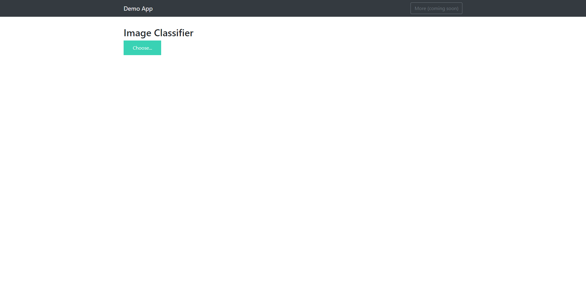
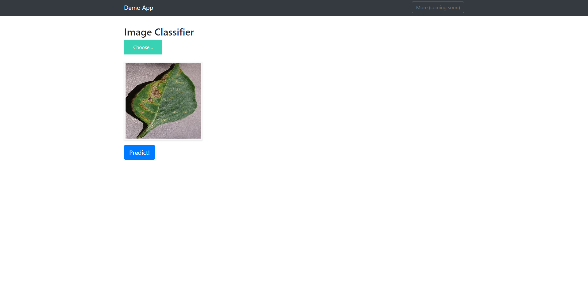
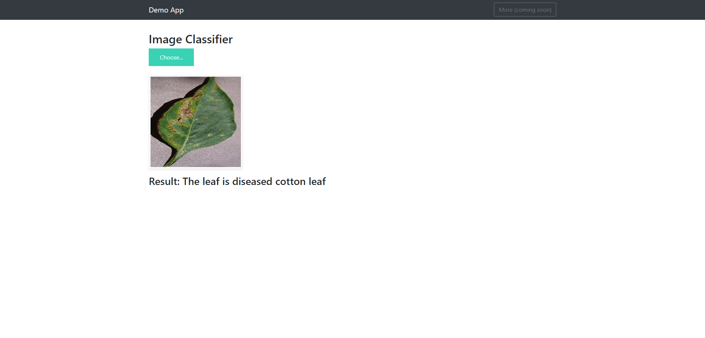

# Plant-Disease-Flask-WebApp
AI WebApp using Tensorflow and Flask 
In this project I have built a WebApp that detects diseases on a plant leaf.  
There are various technologies involved, but the main idea is to have an API server running for the backend and using a frontend React WebApp.   
     

  

# Run the WebApp 
python app.py   
